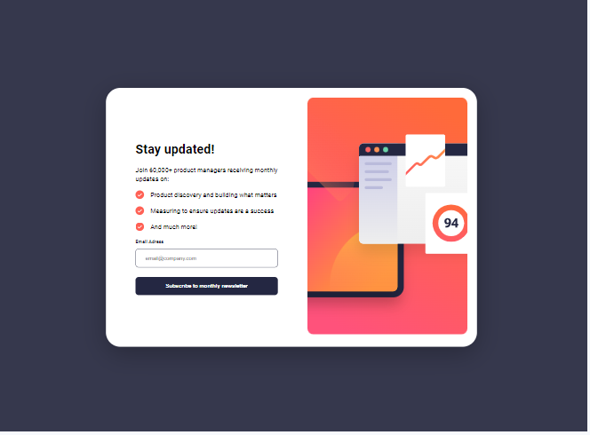

# Frontend Mentor - Newsletter sign-up form with success message solution

This is a solution to the [Newsletter sign-up form with success message challenge on Frontend Mentor](https://www.frontendmentor.io/challenges/newsletter-signup-form-with-success-message-3FC1AZbNrv). Frontend Mentor challenges help you improve your coding skills by building realistic projects. 

## Table of contents

- [Overview](#overview)
  - [The challenge](#the-challenge)
  - [Screenshot](#screenshot)
  - [Links](#links)
- [My process](#my-process)
  - [Built with](#built-with)
  - [What I learned](#what-i-learned)
  - [Continued development](#continued-development)
  - [Useful resources](#useful-resources)
- [Author](#author)


## Overview

### The challenge

Users should be able to:

- Add their email and submit the form
- See a success message with their email after successfully submitting the form
- See form validation messages if:
  - The field is left empty
  - The email address is not formatted correctly
- View the optimal layout for the interface depending on their device's screen size
- See hover and focus states for all interactive elements on the page

### Screenshot




### Links

- Solution URL: [GitHub url](https://github.com/Moulaye-dagnon/Newsltter-sign-up-with-react)
- Live Site URL: [Add live site URL here](https://newsltter-sign-up-with-react.vercel.app/)

## My process

### Built with

- Semantic HTML5 markup
- CSS custom properties
- Flexbox
- CSS Grid
- Mobile-first workflow
- [React](https://reactjs.org/) - JS library


### What I learned


```html
<h1>Some HTML code I'm proud of</h1>
```
```css
.proud-of-this-css {
  color: papayawhip;
}
```
```js
const proudOfThisFunc = () => {
  console.log('🎉')
I learned a better way to create a form and master screen resizing with react.js. In addition, I have improved my use of props and its power  
}
```


### Continued development

I will continue to practice to improve my knowledge and discover new syntaxes, new methods and increase my level of mastery in react.js
### Useful resources

- [Stackoverflow](https://stackoverflow.com/questions/36862334/get-viewport-window-height-in-reactjs) - This forum helped me understand screen resizing in react.js


## Author

- Frontend Mentor - [@moulaye_dagnon](https://www.frontendmentor.io/profile/Moulaye-dagnon)


